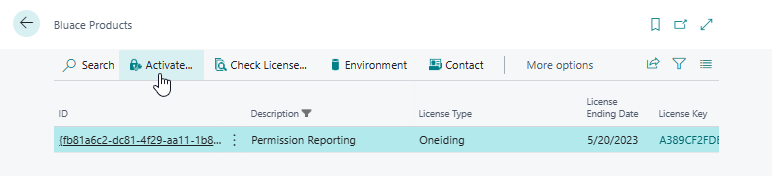
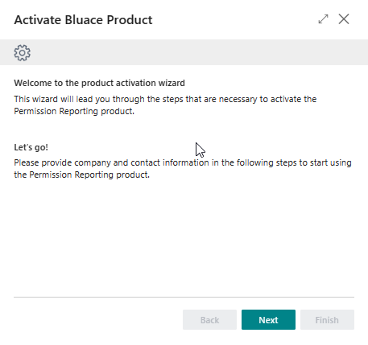

# Manual Permission Reporting
Get easy visibility on your company permission with Permission Reporting.

## Install and activate the app
The following procedure shows how to install the extension through the Extension Management page. 

1.	Choose the Search icon, enter Extension Management, and the choose the related link.
2.	Choose from the menu the Extension Marketplace action.
3.	In the AppSource Apps for Business Central search for Permission Reporting.
4.	Select the App.
5.	Select Get It Now.
6.	Choose from the menu the Deployment Status action.
7.	Check if the status is Complete.

Now the extension is installed, the product must be activated before it can be used.

8.	Choose the Search icon, enter Bluace Products, and choose the related link.

9.	Select the Permission Reporting product and click on the action Activate. This starts a wizard that leads you through the activation steps. After activation is successfully finished, the app is ready for further use.

[:arrow_left:](../README.md) [Back](../README.md)